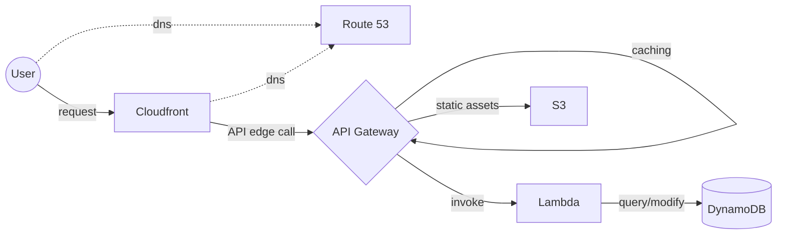

# AWS Serverless Global URL Shortener

This URL shortener project uses AWS API Gateway, Lambda, DynamoDB, and S3 to create a global serverless URL shortener

## Components

- Terraform: the entire infrastructure configuration is written in Terraform
- Functions: the Lambda functions are written in Nodejs
- Static: the static website is a single HTML file
- Requests: Sample requests to test functionality during development

## Infrastructure

The infrastructure utilizes an edge-optimized AWS Gateway that calls lambda functions on edge using CloudFront. These instances query DynamoDB, which is a fully managed key-value store. The API gateway is also responsible for caching the resolved URLs.

The only fixed cost in this setup is the DNS name, and the zone hosting. Everything else scales with the number of requests and amount of data stored.

## Resources

- [AWS Docs](https://docs.aws.amazon.com/apigateway/latest/developerguide/integrating-api-with-aws-services-s3.html#:~:text=To%20set%20up%20response%20header%20mappings%20for%20the%20GET%20/%20method) Set up S3 header forwarding for Content-Type
- [AWS Docs](https://docs.aws.amazon.com/sdk-for-javascript/v3/developer-guide/javascript_dynamodb_code_examples.html) Dynamodb with Nodejs SDK v3
- [Terraform Docs](https://registry.terraform.io/providers/hashicorp/aws/latest/docs) Terraform AWS Provider reference
